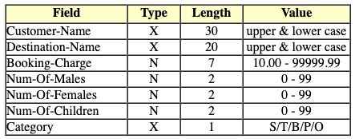
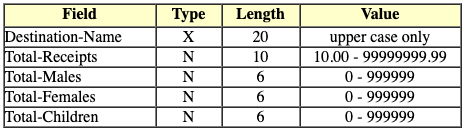

# FlyByNight
a travel agency COBOL lab

### Introduction
The FlyByNight travel agency sends its customers all over the world. For each booking a record is created in the Booking Master file (BOOKING.DAT). Each customer booking is assigned (as part of the record) a category indicating the primary reason for the booking (i.e. Sport, Tourism, Business, Personal and Other). The file is unsorted and each record has the following description;

### The Task
A program is required which will read the Booking Master file to produce a Summary file sequenced upon ascending Destination-Name. Each record in this file will be a summary of all the Tourist records in the Booking file which list a particular location as their destination. The record will show the Destination-Name, the Total-Receipts from tourists travelling to that destination and the Total-Males, Total-Females and Total-Children who make up that tourist population. Each record in the Summary file has the description shown below;

### The Danger Levy
As well as the Booking-Charge, tourists travelling to some destinations will incur an additional insurance charge. This will be levied as a percentage of the Booking-Charge and will be added to it to give a Total-Charge for the booking (e.g. Charge = $250.00, Percentage Insurance = 15%, Total-Charge = $287.50). Listed below are affected countries as well as the insurance charges that travelling to them will incur.

Afghanistan 50%, Cambodia 24%, Corsica 18%, El Salvador 85%,
Haiti 21%, Honduras 23%, Israel 11%, Iran 57%, Iraq 33%,
Note that the Destination-Name in the Booking Master File may be all upper case or all lower case or a mixture. Note also that "France" is not equal to "FRANCE".

### Suggested Procedure
Sort the Booking Master file into Destination-Name order, eliminating all non-tourist records and changing the Destination-Name to upper case before the actual sort is done.

For each group of records for a particular Destination;

Sum all the Males, Females and Children.
Sum all the Booking-Charges.
When all the records for the group have been processed check to see if the destination is in the insurance surcharge group. If it is, work out the insurance charge and add it to the Total-Booking-Charges giving the Total-Receipts.
Set up the output record and write it to the Summary File.
